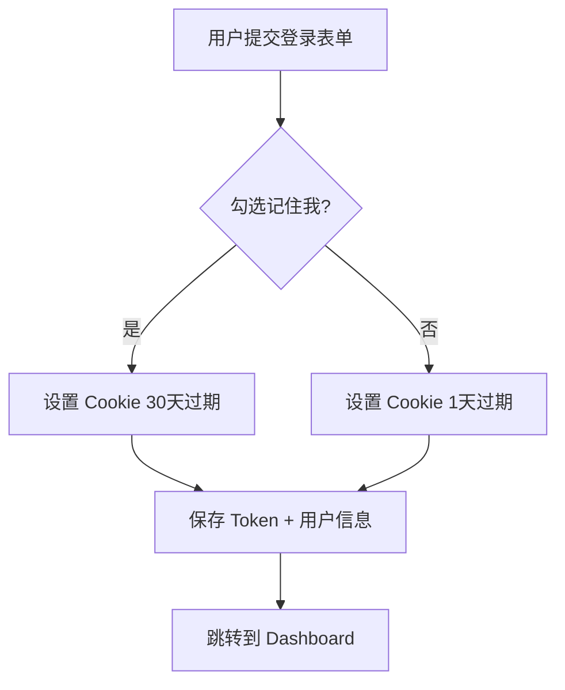
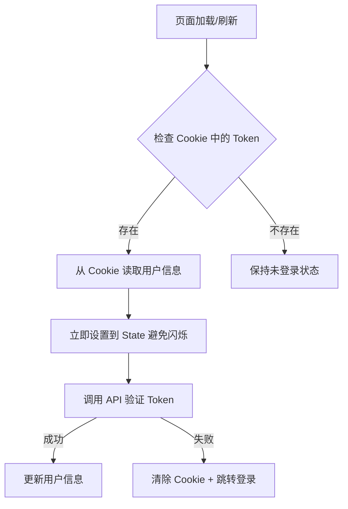

# 登录状态持久化功能说明

## 功能概述

实现了完整的用户登录状态持久化机制，用户登录后即使刷新页面也无需重新登录。

---

## 核心实现

### 1. **Cookie 存储机制**

使用 `js-cookie` 库在浏览器存储以下信息：

| Cookie Key | 内容 | 说明 |
|-----------|------|------|
| `auth_token` | JWT Token | 用于 API 请求认证 |
| `user_info` | 用户信息（JSON） | 缓存用户基本信息 |
| `remember_me` | true/false | 记录是否选择"记住我" |

---

### 2. **过期时间策略**

```typescript
// authService.ts
private readonly TOKEN_EXPIRES_SHORT = 1;  // 1天（未勾选"记住我"）
private readonly TOKEN_EXPIRES_LONG = 30;  // 30天（勾选"记住我"）
```

- **未勾选"记住我"**：Cookie 1天后过期
- **勾选"记住我"**：Cookie 30天后过期

---

### 3. **登录流程**



**代码实现：**
```tsx
// login/page.tsx
await login({
  username: formData.username,
  password: formData.password,
}, formData.rememberMe); // 传递 rememberMe 参数

// AuthContext.tsx
const login = async (credentials: LoginRequest, rememberMe: boolean = false) => {
  const response = await authService.login(credentials, rememberMe);
  setUser(response.user);
  authService.saveAuthData({
    token: response.token,
    user: response.user,
  }, rememberMe);
  router.push('/dashboard');
};
```

---

### 4. **页面刷新恢复**



**代码实现：**
```tsx
// AuthContext.tsx
useEffect(() => {
  const initAuth = async () => {
    const token = Cookies.get('auth_token');
    if (token) {
      try {
        // 先从本地 Cookie 恢复用户信息（避免闪烁）
        const cachedUser = authService.getCurrentUser();
        if (cachedUser) {
          setUser(cachedUser);
        }
        
        // 然后从服务器验证并更新用户信息
        const userData = await authService.getProfile();
        setUser(userData);
      } catch (error) {
        console.error('Failed to get user profile:', error);
        authService.clearAuthData();
        setUser(null);
      }
    }
    setLoading(false);
  };

  // 添加超时保护
  const timeout = setTimeout(() => setLoading(false), 3000);
  initAuth().finally(() => clearTimeout(timeout));
  
  return () => clearTimeout(timeout);
}, []);
```

---

### 5. **自动 Token 刷新**

每 15 分钟自动刷新 Token，延长登录有效期：

```tsx
// AuthContext.tsx
useEffect(() => {
  if (user) {
    const interval = setInterval(async () => {
      try {
        await authService.refreshToken();
      } catch (error) {
        console.error('Failed to refresh token:', error);
        await logout();
      }
    }, 15 * 60 * 1000); // 15分钟

    return () => clearInterval(interval);
  }
}, [user]);
```

---

### 6. **API 请求自动携带 Token**

```typescript
// apiClient.ts
this.client.interceptors.request.use(
  (config) => {
    const token = Cookies.get('auth_token');
    if (token) {
      config.headers.Authorization = `Bearer ${token}`;
    }
    return config;
  }
);
```

---

### 7. **401 自动登出**

当 Token 过期或无效时，自动清除登录状态：

```typescript
// apiClient.ts
this.client.interceptors.response.use(
  (response) => response,
  (error) => {
    if (error.response?.status === 401) {
      // Token过期，清除本地存储并跳转到登录页
      Cookies.remove('auth_token');
      Cookies.remove('user_info');
      Cookies.remove('remember_me');
      if (typeof window !== 'undefined') {
        window.location.href = '/login';
      }
    }
    return Promise.reject(error);
  }
);
```

---

## 安全特性

### 1. **Cookie 安全设置**
```typescript
Cookies.set(this.TOKEN_KEY, authData.token, { 
  expires,
  sameSite: 'strict',  // 防止 CSRF 攻击
});
```

### 2. **Token 验证**
- 每次页面加载都会向服务器验证 Token 有效性
- Token 无效时自动清除本地数据

### 3. **自动超时保护**
- 3秒超时机制，避免 loading 状态永久卡住
- 防止用户体验问题

---

## 用户体验优化

### 1. **无闪烁加载**
```tsx
// 先从 Cookie 读取缓存的用户信息
const cachedUser = authService.getCurrentUser();
if (cachedUser) {
  setUser(cachedUser);  // 立即显示
}

// 然后异步验证并更新
const userData = await authService.getProfile();
setUser(userData);
```

### 2. **Loading 状态管理**
```tsx
const [loading, setLoading] = useState(true);

// 确保 loading 不会永久卡住
const timeout = setTimeout(() => setLoading(false), 3000);
```

---

## 测试场景

### ✅ 场景 1：正常登录
1. 访问 `/login`
2. 输入用户名密码
3. 勾选"记住我"
4. 点击登录
5. **结果**：跳转到 Dashboard，Cookie 30天过期

### ✅ 场景 2：页面刷新
1. 已登录状态
2. 刷新浏览器（F5）
3. **结果**：保持登录状态，无需重新登录

### ✅ 场景 3：关闭浏览器后重新打开
1. 已登录（勾选"记住我"）
2. 关闭浏览器
3. 30天内重新打开浏览器访问
4. **结果**：自动恢复登录状态

### ✅ 场景 4：Token 过期
1. 等待 Token 过期
2. 访问任何需要认证的页面
3. **结果**：自动跳转到登录页

### ✅ 场景 5：手动登出
1. 已登录状态
2. 点击"退出登录"
3. **结果**：清除所有 Cookie，跳转到登录页

---

## 文件清单

### 修改的文件
1. **frontend/src/services/authService.ts**
   - 添加 `REMEMBER_KEY` Cookie
   - 修改 `login()` 接受 `rememberMe` 参数
   - 修改 `saveAuthData()` 支持动态过期时间
   - 添加 `TOKEN_EXPIRES_SHORT` 和 `TOKEN_EXPIRES_LONG`

2. **frontend/src/contexts/AuthContext.tsx**
   - 修改 `login()` 接口支持 `rememberMe` 参数
   - 优化初始化逻辑：先从 Cookie 读取缓存
   - 添加自动 Token 刷新机制

3. **frontend/src/app/login/page.tsx**
   - 传递 `formData.rememberMe` 到 `login()` 函数

4. **frontend/src/services/apiClient.ts**
   - 请求拦截器自动添加 Token
   - 响应拦截器处理 401 错误

---

## 后端要求

后端需要实现以下 API：

1. **POST `/api/v1/auth/login`**
   - 返回：`{ token, user, expires_at }`

2. **GET `/api/v1/auth/profile`**
   - 验证 Token 并返回用户信息

3. **POST `/api/v1/auth/refresh`**
   - 刷新 Token
   - 返回：`{ token, expires_at }`

4. **POST `/api/v1/auth/logout`**
   - 使 Token 失效（可选）

---

## 常见问题

### Q1: 为什么刷新页面会有短暂的 Loading？
**A:** 需要向服务器验证 Token 有效性，但已优化为先显示缓存的用户信息，减少闪烁。

### Q2: Cookie 能被篡改吗？
**A:** Cookie 只是存储 Token，真正的验证在服务器端。即使篡改 Cookie，服务器也会拒绝无效 Token。

### Q3: 如何测试"记住我"功能？
**A:** 
1. 勾选"记住我"登录
2. 打开浏览器开发者工具
3. Application → Cookies → 查看过期时间
4. 未勾选为 1天，勾选为 30天

---

## 总结

✅ **登录状态持久化**：刷新页面无需重新登录  
✅ **记住我功能**：支持 1天/30天 两种过期策略  
✅ **自动恢复**：页面加载时从 Cookie 恢复登录状态  
✅ **Token 刷新**：15分钟自动刷新延长有效期  
✅ **安全保护**：SameSite=strict + 服务器端验证  
✅ **用户体验**：无闪烁加载 + 超时保护  

