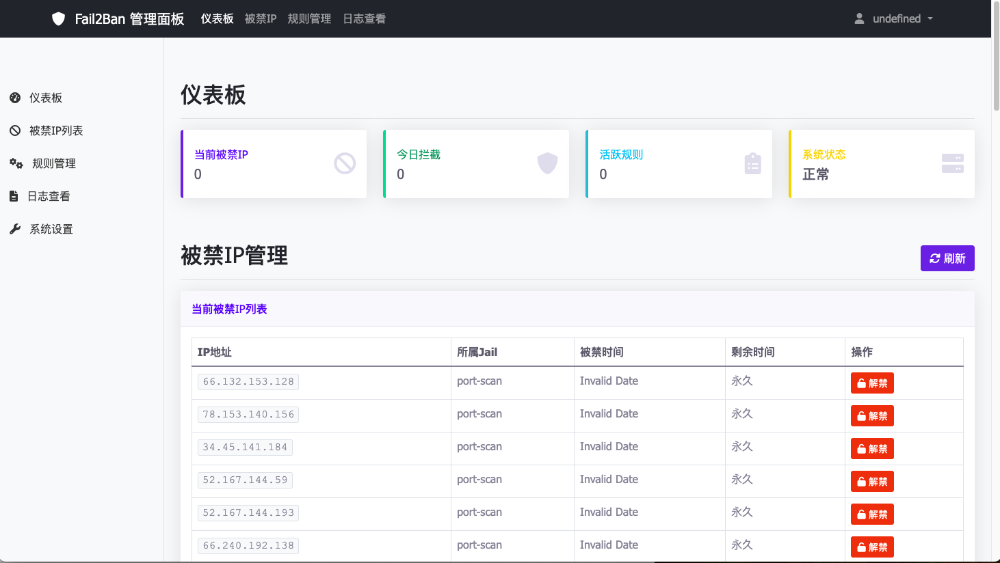

# Fail2Ban 管理面板

一个使用 Golang + Gin 框架构建的 Fail2Ban 管理面板，提供用户友好的 Web 界面来监控和管理 Fail2Ban 服务。

当前还在开发中...
 
欢迎有兴趣的朋友一起参与完善！


## 功能特性

- 🔐 **用户认证**: JWT 基础的用户登录和权限管理
- 📊 **实时监控**: 显示被禁IP地址、统计信息和系统状态
- 🚫 **IP管理**: 查看、解禁被禁IP地址，手动添加禁止IP
- ⚙️ **规则管理**: 管理 Fail2Ban jail 配置
- 📝 **日志查看**: 查看和搜索 Fail2Ban 日志
- 🐳 **容器化**: 支持 Docker 部署
- 📱 **响应式设计**: 支持移动设备和桌面端

## 技术栈

- **后端**: Golang, Gin 框架
- **前端**: HTML5, CSS3, JavaScript (Bootstrap 5)
- **数据库**: SQLite (GORM)
- **认证**: JWT
- **容器化**: Docker & Docker Compose

## 快速开始

### 前置要求

- Go 1.21+
- Fail2Ban 服务已安装并运行
- Docker (可选，用于容器化部署)



### 本地开发

1. **克隆项目**
```bash
git clone <repository-url>
cd fail2ban_web
```

2. **安装依赖**
```bash
make deps
```

3. **运行应用程序**
```bash
make run
```

4. **访问应用程序**
打开浏览器访问 `http://localhost:8080`

默认管理员账户：
- 用户名: `admin`
- 密码: `admin123`

### Docker 部署

1. **使用 Docker Compose (推荐)**
```bash
make compose-up
```

2. **或者使用 Docker**
```bash
make docker-build
make docker-run
```

## 项目结构

```
fail2ban_web/
├── cmd/                    # 应用程序入口
│   └── main.go
├── internal/               # 内部包
│   ├── handler/           # HTTP 处理器
│   ├── middleware/        # 中间件
│   ├── model/            # 数据模型
│   └── service/          # 业务逻辑
├── web/                   # 前端资源
│   ├── static/           # 静态文件 (CSS, JS)
│   └── templates/        # HTML 模板
├── config/               # 配置文件
├── Dockerfile           # Docker 构建文件
├── docker-compose.yml   # Docker Compose 配置
├── Makefile            # 构建脚本
└── go.mod              # Go 模块文件
```

## API 文档

### 认证接口

- `POST /api/v1/auth/login` - 用户登录
- `POST /api/v1/auth/register` - 用户注册
- `GET /api/v1/auth/profile` - 获取用户信息
- `POST /api/v1/auth/refresh` - 刷新 Token

### Fail2Ban 接口

- `GET /api/v1/health` - 健康检查
- `GET /api/v1/stats` - 获取统计信息
- `GET /api/v1/system-info` - 获取系统信息
- `GET /api/v1/banned-ips` - 获取被禁IP列表
- `POST /api/v1/unban` - 解禁IP
- `POST /api/v1/ban` - 手动禁止IP
- `GET /api/v1/jails` - 获取jail列表
- `GET /api/v1/logs` - 获取日志

## 配置

应用程序支持通过环境变量进行配置：

| 变量名 | 默认值 | 描述 |
|--------|---------|------|
| `PORT` | `8080` | 服务器端口 |
| `HOST` | `0.0.0.0` | 服务器地址 |
| `GIN_MODE` | `release` | Gin 运行模式 |
| `DB_PATH` | `./fail2ban_web.db` | 数据库文件路径 |
| `JWT_SECRET` | `your-secret-key...` | JWT 密钥 |
| `JWT_EXPIRE_TIME` | `24` | JWT 过期时间(小时) |
| `FAIL2BAN_LOG_PATH` | `/var/log/fail2ban.log` | Fail2Ban 日志路径 |

## 开发命令

```bash
# 构建应用程序
make build

# 运行应用程序
make run

# 运行测试
make test

# 代码格式化
make fmt

# 热重载开发
make dev

# 构建所有平台版本
make build-all

# Docker 相关
make docker-build
make docker-run
make compose-up

# 查看所有可用命令
make help
```

## 部署注意事项

1. **权限要求**: 应用程序需要访问 Fail2Ban 命令行工具和日志文件的权限
2. **网络安全**: 在生产环境中，请更改默认的 JWT 密钥
3. **防火墙**: 确保 8080 端口在防火墙中已开放
4. **SSL/TLS**: 生产环境建议使用反向代理 (Nginx) 配置 HTTPS

## 许可证

本项目采用 MIT 许可证。详见 [LICENSE](LICENSE) 文件。

## 贡献

欢迎提交 Issue 和 Pull Request！

## 支持

如果您遇到任何问题，请创建一个 Issue 或查看文档。


